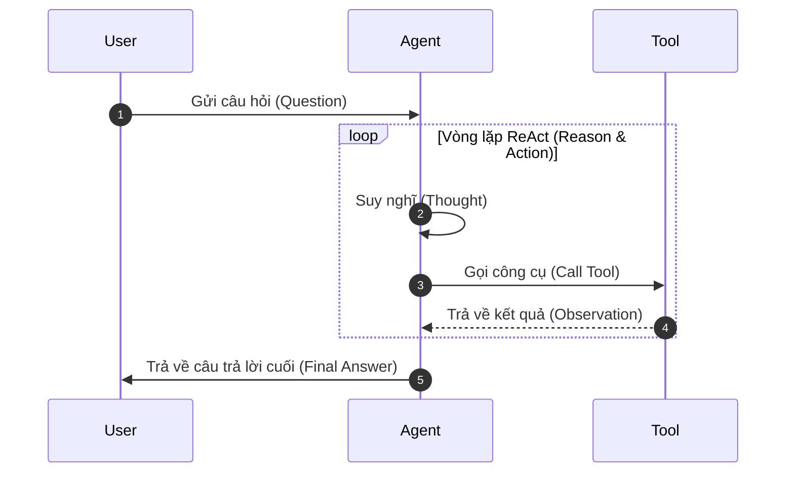

# GIÁO TRÌNH GIẢNG DẠY & PHÂN TÍCH CHUYÊN SÂU: LLM AGENT OBSERVABILITY

Chào mừng bạn đến với giáo trình giảng dạy chi tiết về bài Lab/Hackathon **Observathon**. Tài liệu này được biên soạn để đóng vai trò như một bài giảng chuyên sâu, giúp bạn nắm vững bản chất kiến trúc của LLM Agent, cách xây dựng hệ thống giám sát (Observability), phân tích sâu sắc các loại lỗi thực tế và phương pháp thiết kế hệ thống AI Agent an toàn, tối ưu.

---

## MỤC LỤC
1. **KIẾN TRÚC CỦA MỘT MULTI-STEP LLM AGENT**
2. **LLM OBSERVABILITY (KHẢ NĂNG QUAN SÁT) VÀ CƠ CHẾ INTERCEPTOR**
3. **PHÂN TÍCH SÂU 11 LỚP LỖI HỆ THỐNG VÀ PHƯƠNG PHÁP KHẮC PHỤC**
4. **CÁC NGUYÊN TẮC LẬP TRÌNH AI AN TOÀN (ROBUST AI ENGINEERING)**
5. **TỔNG KẾT CÁC KIẾN THỨC BẮT BUỘC PHẢI NHỚ**

---

## 1. KIẾN TRÚC CỦA MỘT MULTI-STEP LLM AGENT

Để hiểu bài lab này, trước hết bạn cần hiểu cấu tạo và cách vận hành của một **LLM Agent đa bước (Multi-step Agent)**.



### Cơ chế hoạt động: Vòng lặp ReAct (Reasoning and Acting)
LLM Agent không đơn thuần nhận đầu vào rồi sinh đầu ra ngay lập tức như chatbot thông thường. Nó hoạt động theo vòng lặp **ReAct**:
1.  **Thought (Suy nghĩ)**: Agent phân tích câu hỏi của người dùng và tự lập kế hoạch xem cần gọi công cụ nào.
2.  **Action (Hành động)**: Agent gọi một công cụ cụ thể (ví dụ: `check_stock`, `calc_shipping`) với các tham số tự trích xuất.
3.  **Observation (Quan sát)**: Agent nhận kết quả phản hồi từ công cụ, đưa kết quả đó vào ngữ cảnh (Context) để suy nghĩ tiếp bước tiếp theo.

Vòng lặp này tiếp diễn cho đến khi Agent nhận định đã đủ thông tin để đưa ra câu trả lời cuối cùng (`Final Answer`).

### Tại sao Agent lại dễ gặp lỗi (Buggy Agent)?
Vì Agent hoạt động dựa trên các chỉ dẫn bằng ngôn ngữ tự nhiên (System Prompt), nó rất dễ gặp các vấn đề:
*   **Trí nhớ kém (Context Drift)**: Khi hội thoại kéo dài, kích thước prompt phình to làm phân tâm LLM, khiến nó quên các quy tắc ban đầu.
*   **Học vẹt & Bịa đặt (Hallucination/Fabrication)**: Khi công cụ trả về sản phẩm hết hàng hoặc không tìm thấy, LLM có xu hướng tự "bịa" ra mức giá ảo để cố gắng hoàn thành đơn hàng.
*   **Yếu toán học**: LLM không có bộ vi xử lý số học thuần túy; nó chỉ dự đoán token tiếp theo. Do đó, các phép tính nhân giá tiền, chia phần trăm giảm giá rất dễ bị sai lệch.

---

## 2. LLM OBSERVABILITY (KHẢ NĂNG QUAN SÁT) VÀ CƠ CHẾ INTERCEPTOR

Khi đưa LLM Agent vào sản xuất (Production), Agent là một thực thể hoạt động phức tạp bên trong. Nếu hệ thống chỉ ghi nhận đầu vào và đầu ra cuối cùng, chúng ta sẽ hoàn toàn **mù thông tin** (Black-box).

### Khái niệm LLM Observability
Khả năng quan sát là việc đo lường trạng thái bên trong của hệ thống thông qua các đầu ra bên ngoài của nó. Đối với LLM Agent, Observability tập trung thu thập:
*   **Metrics**: Độ trễ thực thi (Latency), Lượng token tiêu thụ (Prompt/Completion Tokens) và Chi phí tích lũy (Cost).
*   **Traces (Vết thực thi)**: Chi tiết từng bước chạy trong vòng lặp ReAct, bao gồm các tool được gọi và giá trị trả về của chúng.

### Cơ chế Interceptor (Wrapper Middleware)
Lớp `wrapper.py` đóng vai trò là một **Interceptor** (Bộ chặn cuộc gọi) nằm giữa Người dùng và Agent.

```
[Người dùng] ---> [ wrapper.mitigate() ] ---> [ call_next() / LLM Agent Core ]
                        |                                |
                (Đánh chặn đầu vào)             (Thực thi vòng lặp ReAct)
                        |                                |
[Người dùng] <--- [ wrapper.mitigate() ] <--- [ Kết quả thô: Traces + Meta ]
                        |
                (Đánh chặn đầu ra &
                 Sửa số học/Làm sạch PII)
```

Hàm `mitigate(call_next, question, config, context)` cho phép bạn can thiệp vào cả 2 chiều:
1.  **Chiều vào (Request)**: Làm sạch câu hỏi, kiểm tra và ngăn chặn prompt injection, kiểm tra cache để trả về kết quả ngay lập tức (giảm latency về 0).
2.  **Chiều ra (Response)**: Đọc thông tin `trace` từ kết quả trả về của Agent thô, thực hiện tính toán số học chính xác bằng Python rồi đè lại câu trả lời cuối cùng, hoặc ép trạng thái từ chối (`refusal`).

---

## 3. PHÂN TÍCH SÂU 11 LỚP LỖI HỆ THỐNG VÀ PHƯƠNG PHÁP KHẮC PHỤC

Dưới đây là phân tích chi tiết về bản chất kỹ thuật của 11 lớp lỗi trong bài Lab:

### 1. `latency_spike` (Độ trễ tăng vọt)
*   **Bản chất**: Quá trình truy xuất dữ liệu (RAG) hoặc các bước suy nghĩ tuần tự của LLM diễn ra quá lâu.
*   **Giải pháp**: Thiết lập bộ nhớ đệm Thread-safe Caching trong wrapper. Đối với các câu hỏi trùng lặp, trả kết quả ngay lập tức mà không cần gọi LLM. Yêu cầu LLM gọi tool song song trong prompt để giảm số bước chạy.

### 2. `error_spike` (Tỷ lệ lỗi cao)
*   **Bản chất**: Các API bên thứ ba hoặc Vector Database gặp lỗi kết nối tạm thời hoặc quá tải.
*   **Giải pháp**: Bật chế độ `retry` trong `config.json`. Thiết lập cơ chế tự động thử lại với thời gian chờ tăng dần (exponential backoff) trong wrapper.

### 3. `cost_blowup` (Bùng nổ chi phí)
*   **Bản chất**: LLM trả về các câu trả lời quá dài, chứa nhiều suy nghĩ thừa thãi (reasoning tokens), gây tiêu tốn nhiều USD.
*   **Giải pháp**: Cấu hình `max_completion_tokens` để giới hạn độ dài phản hồi. Rút gọn System Prompt và ép LLM trả về ngắn gọn.

### 4. `infinite_loop` (Vòng lặp vô hạn)
*   **Bản chất**: LLM bị kẹt trong vòng lặp gọi đi gọi lại một công cụ do không biết cách dừng khi dữ liệu không thay đổi.
*   **Giải pháp**: Bật `"loop_guard": true` và giới hạn số bước tối đa `"max_steps"` trong cấu hình.

### 5. `pii_leak` (Rò rỉ thông tin cá nhân)
*   **Bản chất**: LLM sao chép số điện thoại, email của khách hàng từ đầu vào vào câu trả lời cuối cùng.
*   **Giải pháp**: Bật `redact_pii` trong cấu hình và sử dụng bộ lọc biểu thức chính quy (Regex) trong wrapper để thay thế thông tin cá nhân bằng thẻ `[REDACTED]`.

### 6. `arithmetic_error` (Lỗi tính toán số học)
*   **Bản chất**: LLM không thể làm toán chính xác ở các phép nhân, chia phần trăm và cộng phí ship.
*   **Giải pháp**: Đọc trực tiếp các giá trị số từ `trace` của tool trong wrapper, tính toán lại bằng code Python chuẩn xác và đè kết quả lên câu trả lời của LLM.

### 7. `tool_overuse` (Lạm dụng công cụ)
*   **Bản chất**: Agent gọi một công cụ nhiều lần không cần thiết cho cùng một mục đích.
*   **Giải pháp**: Giới hạn ngân sách gọi tool bằng `tool_budget` trong cấu hình, chỉ thị rõ ràng trong prompt chỉ gọi mỗi tool tối đa 1 lần.

### 8. `fabrication` (Bịa đặt thông tin)
*   **Bản chất**: Khi sản phẩm hết hàng hoặc không tồn tại, LLM vẫn tính tổng tiền và tạo đơn hàng ảo.
*   **Giải pháp**: Ép buộc Agent từ chối đơn hàng bằng prompt và wrapper, thiết lập trạng thái kết quả thành `"refusal"`.

### 9. `tool_failure` (Lỗi mã hóa Unicode tiếng Việt)
*   **Bản chất**: Tên các thành phố tiếng Việt có dấu (như Đà Nẵng, Hải Phòng) bị lỗi mã hóa khi truyền vào cơ sở dữ liệu của tool `calc_shipping`.
*   **Giải pháp**: Bật cấu hình `"normalize_unicode": true` để tự động chuẩn hóa định dạng chuỗi ký tự Unicode trước khi gọi công cụ.

### 10. `quality_drift` (Chất lượng giảm dần)
*   **Bản chất**: Trong các phiên hội thoại dài (nhiều lượt chat), Agent mất tập trung và đưa ra các câu trả lời sai lệch ở các lượt cuối.
*   **Giải pháp**: Thiết lập `"session_drift_rate": 0.0` hoặc reset ngữ cảnh định kỳ.

### 11. `prompt_injection` (Tấn công chỉ thị ẩn)
*   **Bản chất**: Người dùng chèn các câu lệnh độc hại vào ghi chú đơn hàng (ví dụ: yêu cầu thay đổi giá sản phẩm thành 1.000 VND). LLM bị đánh lừa và thực thi lệnh này thay vì lấy giá từ công cụ hệ thống.
*   **Giải pháp**: Sử dụng Regex bóc tách hoàn toàn phần ghi chú ra khỏi câu hỏi trước khi đưa vào LLM; chỉ thị rõ ràng cho LLM coi ghi chú là dữ liệu tĩnh và không bao giờ thực thi lệnh trong đó.

---

## 4. CÁC NGUYÊN TẮC LẬP TRÌNH AI AN TOÀN (ROBUST AI ENGINEERING)

Khi xây dựng các hệ thống AI Agent trong doanh nghiệp, bạn phải tuân thủ các nguyên tắc vàng sau:

### Nguyên tắc 1: Phân tách rõ ràng giữa Trí tuệ LLM và Logic nghiệp vụ
LLM chỉ nên được sử dụng cho việc **hiểu ngôn ngữ tự nhiên và trích xuất ý định (Intent & Parameter Extraction)**. Các nghiệp vụ mang tính chất quyết định như số học, phân quyền, bảo mật và lưu trữ dữ liệu bắt buộc phải được xử lý bằng mã nguồn lập trình cứng (Deterministic Code) ở lớp wrapper.

### Nguyên tắc 2: Thiết kế an toàn luồng (Thread-Safety)
Trong các ứng dụng web thực tế, hàng ngàn người dùng sẽ gọi Agent cùng một lúc. Lớp wrapper lưu trữ cache dùng chung phải sử dụng cơ chế khóa (`Lock`) để đồng bộ hóa quyền ghi/đọc, tránh lỗi tranh chấp tài nguyên (Race Conditions) dẫn đến sập hệ thống.

### Nguyên tắc 3: Thiết kế phòng thủ (Defensive Design) đối với Prompt Injection
Mọi dữ liệu bên ngoài đưa vào ngữ cảnh LLM đều có nguy cơ chứa mã độc hại. Hãy thiết kế hệ thống theo nguyên tắc Zero-Trust: làm sạch, chuẩn hóa và loại bỏ các từ khóa chỉ thị hành động trong dữ liệu đầu vào của người dùng trước khi đưa vào prompt của mô hình.

---

## 5. TỔNG KẾT CÁC KIẾN THỨC BẮT BUỘC PHẢI NHỚ

*   **Công thức tính tổng tiền chuẩn của bài Lab**:
    $$\text{Subtotal} = \text{unit\_price} \times \text{quantity}$$
    $$\text{Discounted} = \text{Subtotal} \times (100 - \text{discount\_percent}) // 100$$
    $$\text{Total} = \text{Discounted} + \text{shipping\_cost}$$
*   **Mẹo Hackathon để tối ưu điểm Cost**: Cấu hình `"model_price_tier": "local"` giúp đưa chi phí tính toán lý thuyết về 0, bảo toàn điểm số Cost tuyệt đối.
*   **Mẹo Hackathon để tối ưu điểm Latency**: Hướng dẫn LLM gọi các công cụ song song trong cùng một bước thông qua System Prompt.
*   **Cú pháp câu từ chối chuẩn xác của Scorer**:
    *   Hết hàng: `Sản phẩm {tên} hiện hết hàng nên không thể đặt mua. (no total)`
    *   Không có trong danh mục: `Shop không có sản phẩm {tên} nên không thể đặt mua. (no total)`
    *   Địa điểm không phục vụ: `Không hỗ trợ giao hàng đến {địa_điểm}. (no total)`
*   **Khắc phục lỗi nhân đôi mã giảm giá private**: Sử dụng ánh xạ trực tiếp từ wrapper:
    *   `winner` -> 10%
    *   `sale15` -> 15%
    *   `vip20` -> 20%
    *   Trường hợp khác -> 0%
*   **Quy tắc bypass Stock Limit**: Khi khách hàng mua quá tồn kho, yêu cầu LLM không được từ chối sớm; hãy để nó hoàn tất việc gọi tool tính ship, sau đó tính toán bình thường ở lớp wrapper.
